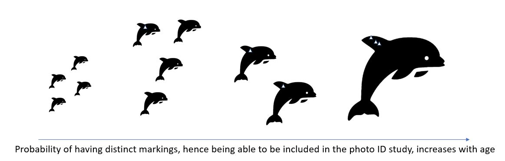

```{r setup, include=FALSE}
knitr::opts_chunk$set(echo = TRUE,cache = TRUE)
library(knitr)
library(ggplot2)
library(tidyverse)
library(hrbrthemes)
library(viridis)
```

# Preamble

***This will be a general preable common to all the documents included as Electronic Supplements to CARMMHA's offshore injury paper. The exact preamble will be finalized at the time of submission to reflect the submission date and final title, structure, authors etc.***

This is an Electronic Supplement to the paper submited to MEPS on the ??-??-???? by Marques, T. A., Thomas, L., Booth, C., Garrison, L. P., Rosel, P. E., Mullin, K. D. & L. Schwacke entitled "Quantifying Deepwater Horizon oil spill induced injury on offshore cetaceans".

The master file with supplementary material is here: [Electronic Supplements master file](ElectronicSupplements.html).

# Background

In this document we describe the required analysis to estimate a baseline survival and the post-oil spill survival, which together provide a survival reduction.

# Baseline Survival

To estimate a distribution for the baseline survival in bottlenose dolphins we consider the sex and age specific survival from the Siler model results. 

Since we need a population-averaged survival rate, to obtain it we multiply the age- and sex- specific survival estimates from the Siler model by the proportion of the population estimated to be in each age- and sex- class.

However, there is one further complication to consider first.  The baseline survival will be compared with survival post-spill that is calculated from a Spatial Capture-Recapture (SCR) model, based on a Photo-ID model. The full SCR analysis is the focus of a dedicated SCR paper by Glennie et al. 2021.  

The SCR Photo-ID estimate of survival is a biased estimate of the population average survival because the population that is makes inferences for not the entire population, excluding the animals that dnot possess natural markings that would make them available to bve marked in the SCR. In particular,  young animals are not represented in the photo-ID catalog -- they tend not to have acquired the markings that enable them to be uniquely identifiable. Hence, a first step is to use a separate dataset on whether animals are marked as a function of known age to estimate the proportion marked in each age class.

We note upfront this wording might cause some confusion. The **proportion marked** could be used to refer to:

1. the proportion of animals that have been marked in a MR context, and
2. the proportion of animals that could be marked in a photo-ID capture recapture context because they have marks tham make them uniquely identifiable.

Here, when we use the wording "proportion marked", we are referring to the latter.



Based on this proportion marked, we calculate a baseline survival that can be compared with the SCR estimate by accounting for the proportion of animals (of ech sex) at each age that could have been included in the capture recapture study.

Essentially, a population averaged survival probability ($\bar S$) is given by

$$ \bar S = \sum_{i=0}^{60} \sum_{j=1}^2  s_{ij} \times q_{ij}$$

where

$$ q_{ij} = \frac{p_{ij}\times p(M|i)_{ij}}{\sum_{i=0}^{60} \sum_{j=1}^2 p_{ij}\times p(M|i)_{ij}}$$

where $s_{ij}$ is the survival probability for age $i$ and sex $j$, $p_{ij}$ is the proportion of the population in age $i$ and sex $j$, $p(M|i)_{ij}$ is the proportion of animals of age $i$ and sex $j$ that are marked. Note therefore that $q_{ij}$ is the the proportion of animals maked in age $i$ and sex $j$.

Below we simulate each of these quantities, and propagate the corresponding uncertainty into $\bar S$ by sampling from the distribution of simulations for each of the components.

## Probability of being marked as a function of age

We consider a dataset containing known-age animals (from health assessments, etc.) from Barataria Bay (Lori Schwacke, unpublished data), and performed a binary logistic regression to estimate the probability of an animal being marked as a function of age and other covariates.

For each of these animals there was a record of whether the animals had markings that would allow them to be marked by photo-ID, and hence being included in the pool of animals used to estimate survival from the SECR model.

Read in the data, from file "BaselineSurvSIdata.txt". Note that the original data had additional columns, with different characteristics associated with animals. However, we striped the file from anything that was not found to be relevant. As an example, the sex of the animal is not in the table, because we found no evidence for there to be sex related differences in the probability of an animal being marked as a function of age.

```{r}
#Read in data file
MRdata <- read.csv("InputFiles/BaselineSurvSIdata.txt", sep="")
```

Our objective is to model how the probability of an animal being marked (i.e. having been recruited into the capture-recapture (CR) study in Barataria Bay (BAR) from which we get baseline survival), `Marked` as a function of potential covariates such as its age on capture `AgeCap`. These were fitted with `gam` from package `mgcv`

```{r,warnings=FALSE,message=FALSE,echo=FALSE}
library(mgcv)
```

Preliminary analysis showed that uncertainty was high at age 0, when we know probability of being marked is 0, so we considered a constrained GAM enforcing that P(marked) is 0 at age 0. Besides looking for sex differences, we also investigated imputing zero's for all animals at age 0 to force P(marked|age=0), but the constrained GAM was favoured approach. 

The constrained model considered is shown below

```{r,echo=FALSE}
AgeCap <- seq(0, max(MRdata$AgeCap), length = 1000)
# preparing knots for the constrained GAM
n.knots <- 5
knots <- list(AgeCap = seq(min(MRdata$AgeCap, na.rm = TRUE), max(MRdata$AgeCap, na.rm = TRUE), length = n.knots))
#Fit a constrained GAM - constrained so that at x=0 y=plogis(-min.val) 
# (where min.val is about -4) so about 0.  Note that the choice of min.val
# affects the fit, unfortunately.
min.val <- -4
sm <- smoothCon(s(AgeCap, k = n.knots, bs = "cr"), data = MRdata, knots = knots)[[1]]

X <- sm$X[, -1]
S <- sm$S[[1]][-1, -1]
off.set <- MRdata$Marked * 0 + min.val 

gamAge.constr <- gam(Marked ~ X - 1 + offset(off.set), paraPen = list(X = list(S)), 
                         data = MRdata, family = binomial)
```

```{r,echo=FALSE}
newdata = data.frame(AgeCap = AgeCap)
sm2 <- smoothCon(s(AgeCap, k = n.knots, bs = "cr"), data = newdata, knots = knots)[[1]]
X2 <- sm2$X[, -1]
S2 <- sm2$S[[1]][-1, -1]
off.set2 <- rep(min.val, length = nrow(newdata))
y.pred2 <- predict(gamAge.constr, newdata = list(AgeCap = newdata$AgeCap, X = X2, off.set = off.set2))
y.pred2 <- plogis(y.pred2)
```

```{r,echo=FALSE}
#Plot the data
par(mfrow=c(1,1),mar=c(4,4,0.5,0.5))
with(MRdata, plot(Marked ~ AgeCap,xlim=c(0,45)))
lines(newdata$AgeCap, y.pred2, col = "green")
```

We generate resamples from this model to propagate model uncertainty further. Here we make 4,000 replicate predictions for integer ages from 0 to 40 and save these to a csv file.

We present also the observed proportions of marked animals as a function of age as a goodness of fit assessment. The fit looks reasonable, except for the first bin, where we predict a lower proportion of marked animals than that observed. 

This is likely induced by the fact that the process of marking as a function of (young) age is not well approximated by the logistic link function. We move forward assuming that the impacts of this misfit would be negligible for our purposes, especially given all the uncertainty around this process. 

```{r}
AgeCap <- 0:60
newdata = data.frame(AgeCap = AgeCap)
sm2 <- smoothCon(s(AgeCap, k = n.knots, bs = "cr"), data = newdata, knots = knots)[[1]]
X2 <- sm2$X[, -1]
S2 <- sm2$S[[1]][-1, -1]
off.set2 <- rep(min.val, length = nrow(newdata))

set.seed(20932)
#Plot the data
with(MRdata,plot(Marked~AgeCap,xlim=c(0,45)))
#Make predictions
Xp <- predict(gamAge.constr, newdata = list(AgeCap = newdata$AgeCap, X = X2, off.set = off.set2), type = "lpmatrix")
# define number of resamples
B <- 4000
br <- MASS::mvrnorm(B, coef(gamAge.constr), gamAge.constr$Vp)
res <- numeric(B)

predictions <- matrix(0, B, length(AgeCap))
for(i in 1:B){
  predictions[i, ] <- plogis(Xp %*% br[i, ] + min.val)[, 1]
  lines(AgeCap,predictions[i, ]) 
}
#Add in the original fit
ori.AgeCap <- seq(0, max(MRdata$AgeCap), length = 1000)
lines(ori.AgeCap, y.pred2, col = "green", lwd = 2)
#Divide data into n.dots equal portions by age and calculate proportion of marked for each portion
n.dots <- 7
ord <- order(MRdata$AgeCap)
ind <- rep(1:n.dots, each = length(ord)/n.dots)
if(length(ind) > length(ord)) ind <- ind[1:length(ord)]
ind <- c(ind, rep(n.dots, length(ord) - length(ind)))
mean.p <- by(MRdata$Marked[ord], ind, mean)
mean.age <- by(MRdata$AgeCap[ord], ind, mean)
mean.n <- by(MRdata$AgeCap[ord], ind, length)
points(mean.age, mean.p, pch = 16, col = "blue")
for(i in 1:length(mean.p)){
  conf <- Hmisc::binconf(mean.p[i] * mean.n[i], mean.n[i])
  lines(c(mean.age[i], mean.age[i]), conf[2:3], col = "blue")
}
```

In the above, the black lines are `r B` replicate predictions from the fit, the blue dots are the average proportion marked from the data grouped into `r n.dots` approximately equally sized bins and the blue vertical lines are 95\% binomial confidence intervals on these proportions. 

Below we represent the probability of being marked as a function of age and the corresponding pointwise percentile confidence intervals.

```{r}
#plot mean predictions, with confidence interval
plot(AgeCap, apply(predictions, 2, mean), type = "l", ylab = "p(marked)", xlab = "Age")
lines(AgeCap, apply(predictions, 2, quantile, 0.025),  lty = 2)
lines(AgeCap, apply(predictions, 2, quantile, 0.975),  lty = 2)
```

**TAM: The confidence bands above seem narrower than what I'd expect from the first plot???**

```{r}
# write results to use further, as neded 
write.csv(predictions,"InputFiles/pmarked.csv",row.names = FALSE)
```

## Age and sex specific survival

The Siler model provides us the probability of survival as a function of age and sex.

A separate description of the survival for the different taxonomic units is the purpose of "ComparingSurvivalsAcrossStocks.Rmd". 

Replicating that code, here we simply use the Siler model to obtain survival as a function of age and sex for the botlenose dolphin baseline population.

```{r,echo=FALSE,warning=FALSE}
# Siler model functions are here
source("Functions/SilerFuns.R")       
#--------------------------------------------------------------------------
# Survival
#--------------------------------------------------------------------------
# reading in Siler parameters, for males and females
# These files were provided by LS via email on the Fri 5/22/2020 4:10 PM
pf <- read.csv("InputFiles/var_female 15May2020.csv")
pm <- read.csv("InputFiles/var_male 15May2020.csv")
# remove useless ID first column 
pf<-pf[, -1]
pm<-pm[, -1]
# rename columns
names(pf) <- names(pm) <- c("a1", "a2", "a3", "b1", "b3", "rmean")
#--------------------------------------------------------------------------
ages <- 0:60
ncols <- nrow(pf)
nrows <- length(ages)
#get a dataframe to use ggplot2
#objects to hold female and male realizations
pxFs <- matrix(NA,nrow=nrows,ncol=ncols)
pxMs <- matrix(NA,nrow=nrows,ncol=ncols)
#for each obseration of the posterior
for(i in 1:nrow(pf)){
  #get the funtion
  pxFs[,i] <- px(ages,pf[i,1],pf[i,2],pf[i,3],pf[i,4],pf[i,5])
  pxMs[,i] <- px(ages,pm[i,1],pm[i,2],pm[i,3],pm[i,4],pm[i,5])
}
#arrange as data frame
pxFs2 <- data.frame(pxFs,ages=ages)
pxMs2 <- data.frame(pxMs,ages=ages)
# add means and relevant quantiles
pxFs2$mean=rowMeans(pxFs)
pxMs2$mean=rowMeans(pxMs)
pxFs2$q025=apply(X=pxFs,MARGIN = 1,FUN=quantile,probs=0.025)
#two out of 4000*71 values are NA's?
pxMs2$q025=apply(X=pxMs,MARGIN = 1,FUN=quantile,probs=0.025,na.rm=TRUE)
pxFs2$q975=apply(X=pxFs,MARGIN = 1,FUN=quantile,probs=0.975)
pxMs2$q975=apply(X=pxMs,MARGIN = 1,FUN=quantile,probs=0.975,na.rm=TRUE)
#add the sex
pxFs2$sex="Female"
pxMs2$sex="Male"
#make single object
#note dim(pxMF)
#[1]  122 4005
#4005=4000 iterations plus age, sex, mean, quantile 0.025 and quantile 0.975
pxMF <- rbind(pxFs2,pxMs2)
```

```{r}
#plot
#https://www.r-graph-gallery.com/104-plot-lines-with-error-envelopes-ggplot2.html
ggplot(data=pxMF, aes(x=ages, y=mean, ymin=q025, ymax=q975, fill=sex, linetype=sex)) + geom_line() + 
 geom_ribbon(alpha=0.5) + 
 xlab("Age") + 
 ylab("Age specific Survival")
```


## Proportion of animals in each sex and age class

Given the Siler model, and the population model assumed, we can also can also estimate the baseline abundance per sex and age class.

The baseline proportion of animals in each sex and age class can be obtained by running the same code that sets the baseline population of BND in the runSims.R function.

```{r}
# this code was taken out of "runSims.R" on the version file that was 
# dated from the 26th January 2021. If that function is updated it might
# be sensible to check that this code is still the latest version

#--------------------------------------------------------------------------
Sp <- "Ttru"
set.seed(1234)
#--------------------------------------------------------------------------
# required libraries and functions
#--------------------------------------------------------------------------
# load required libraries
library(popbio)   #for computing mean age and expected time to live
library(mc2d)     # for beta-pert distribution
#--------------------------------------------------------------------------
source("Functions/reqfuns.R")         # most functions are here
#--------------------------------------------------------------------------
# Get all the relevant species information required to run the simulation
SpInfo <- getSpData(Sp)
#--------------------------------------------------------------------------
#--------------------------------------------------------------------------
# Set counters and constants
#--------------------------------------------------------------------------
  i       <- 1             # counter for the simulation iteration
  j       <- 1             # counter for the age class
  na      <- 61            # number of age classes for BND
  ns      <- 2             # number of sexes
  nc      <- 3             # number of conditions (see details above)
  dimm    <- ns * nc * na  # number of classes (2 sexes * 3 conditions * number of age classes)
  ages <- 0:(na-1)         # the ages considered
#------------------------------------------------------------
B<-4000
distNominais<-matrix(NA,nrow=B,ncol=2*na)
for(i in 1:B){
# Initial population size
Nstart <- read.csv(paste0("InOutBySp/",SpInfo$folder,"/N_boot.csv"), header = TRUE)
Nstart <- Nstart[,2]
Nstart<-as.vector(Nstart)
# Note: for smooth functioning "Nstart" and "survs" must have same length 
# (currently 1000 values in each vector)
itersim <- sample(1:length(Nstart),1)
N0sim <- Nstart[itersim]
#--------------------------------------------------------------------------
# Survival
#--------------------------------------------------------------------------
# required information already read in above
#--------------------------------------------------------------------------
#------------------------------------------------------------

  # Survival  
  femalesur <- px(ages, pf[i, 1], pf[i, 2], pf[i, 3], pf[i, 4], pf[i, 5])
  malesur   <- px(ages, pm[i, 1], pm[i, 2], pm[i, 3], pm[i, 4], pm[i, 5])
#------------------------------------------------------------
    # Fecundity
    # get DD fecundity parameters
    Fmaxsim <- with(SpInfo, rpert(1, min = minFmax, mode = modeFmax, max = maxFmax, shape = 4))
    Fnomsim <- with(SpInfo, rpert(1, min = minFnom, mode = modeFnom, max = maxFnom, shape = 4))
    rhosim  <- with(SpInfo, rhoshift+rgamma(1, shape = rhoshape, scale = rhoscale))
    # I need this to make sure don't hit problems with Fnom > Fmax which leads to NaNs!
    # but is this OK ? 
    if(Fmaxsim < Fnomsim) Fnomsim <- Fmaxsim*0.99
    # note below we use the same N0sim twice 
    # this is somewhat strange as it means that F0 becomes Fnomsim - but here anyway
    # Get baseline population fecundity - note this will only be used as such for BB BND
    # for all other taxonomic units we will change the IBI to reach a stable population
    F0 <- ft(Nt = N0sim, Fmax = Fmaxsim, rho  = rhosim, Nnom = N0sim, Fnom = Fnomsim)
    # obtain random deviate of age at first reproduction
    # this is for Tursiops, then scaled if other species
    # sample from right distribution
    a1stRsim <- with(SpInfo, rgamma(1, shape=sha1str, scale=sca1str))
    # the modeling requires an integer
    # and to adjust for possible scaling for non Ttru
    # the -0.5 is justified by a need to adjust the age of maturity to IBI - see emails
    # between LT, LS and TAM (thread ends Sun 6/21/2020 8:28 PM)
    a1stRsim <- round((a1stRsim-0.5))
    # and age at last reproduction - currently no senescent assumed, so commented out
    # alasRsim <- Ttru$alastRep
    # alasRsim <- round(alasRsim/scaling)
    # Baseline reproductive sucess rate
    # This is generated by using a beta with the mean value and variance equivalent
    # to the binomial corresponding to the same number of trials and successes
    # Baseline reproductive success rate
    # deprecated to use external data on survival to get these values directly 
    # n <- SpInfo$n4brs
    # x <- SpInfo$suc4brs
    # p <- x/n
    # var.p <- p * (1 - p) / n
    # get parameters of binomial
    p <- SpInfo$meanbrs
    var.p <- SpInfo$sdbrs
    # transform to corresponding beta parameters
    alpha <- ((1 - p) / var.p - 1 / p) * p ^ 2 
    beta <- alpha * (1 / p - 1) 
    # get Baseline reproductive success rate
    pRepbasesim <- rbeta(1, alpha, beta) 
    #------------------------------------------------------------
    
    #------------------------------------------------------------
    # Get transition matrix
    # note dimm = number of sexes * number of conditions * number of age classes
    M0 <- getM(na = na, dimm = ns*nc*na, femalesur = femalesur, malesur = malesur, srf = 1, N = N0sim, ddfr = F0, frf = 1, a1stR = a1stRsim, alasR     = na)
    #------------------------------------------------------------
    
    # Initial population numbers per class
    # Nominal age distribution is normalized eigen vector associated with dominant eigen value
    ev0 <- eigen(M0)
    distNominal <- Re(ev0$vectors[, 1]) / sum(Re(ev0$vectors[, 1]))
    distNominais[i,]<-distNominal[1:(2*na)]
}
```

Looking at the resulting proportion in each age and sex, while recognizing that this proportion takes strictly a value at each (discrete) age while the representation below is a continous representation of that discrete function.

```{r}
#being lazy and using the ggplot code above!
#to do so re-structure results
SAFEdistNominais<-distNominais
distNominais<-as.data.frame(t(distNominais))
#To understand why this code works one needs to realize that #once like this the data structure is the same as in object
#pxMF above, so we can use what was done there
# add means and relevant quantiles
dNmean <- rowMeans(distNominais)
dNq025 <- apply(X=distNominais,MARGIN = 1,FUN=quantile,probs=0.025)
dNq975 <- apply(X=distNominais,MARGIN = 1,FUN=quantile,probs=0.975)
#now collect
distNominais$mean <- dNmean
distNominais$q025 <- dNq025
distNominais$q975 <- dNq975
#add the sex
pxFs2$sex="Female"
pxMs2$sex="Male"
#add age and sex
distNominais$sex<-pxMF$sex
distNominais$ages<-pxMF$ages
#plot
ggplot(data=distNominais, aes(x=ages, y=mean, ymin=q025, ymax=q975, fill=sex, linetype=sex)) + geom_line() + 
 geom_ribbon(alpha=0.5) + 
 xlab("Age") + 
 ylab("Proportion")
```

## Combining components to get $\bar S$

We finally combine the above components, as described [above](#estimating-the-population-average-survival) to obtain realizations of the population averaged baseline survival. 

This is then used in the simulations, combined with the results from the SCR analysis, to estimate the decrease in survival induced by exposure to oil. 

```{r}
meanS <-numeric(B)
for(i in 1:B){
  qijs<-c(distNominais[1:61,i]*predictions[i,],distNominais[62:122,i]*predictions[i,])/sum(c(distNominais[1:61,i]*predictions[i,],distNominais[62:122,i]*predictions[i,]))
meanS[i]<-sum(pxMF[,i]*qijs)
}
```

And now we can take a look at the distribution of the estimated population averaged survival

```{r,cache=FALSE,warning=FALSE}
#stupid tweak
meanS=data.frame(S=meanS,group=" ")
#plot
#https://www.r-graph-gallery.com/89-box-and-scatter-plot-with-ggplot2.html
meanS %>% ggplot(aes(y=S,x=group)) +
     geom_boxplot() +
     scale_fill_viridis(discrete = TRUE, alpha=0.6) +
     geom_jitter(color="black", size=0.4, alpha=0.9) +
     theme(
       legend.position="none",
       plot.title = element_text(size=11)
     ) +
     ggtitle("Baseline population average survival") +
     xlab("")
```

Finally, we output the resulting distribution of baseline survivals, which incorporates the variance propagated through each of the 3 required components, so that they can be used in the main simulations.

```{r}
write.table(meanS$S,file="InputFiles/BaselineSurvival.csv",quote=FALSE,row.names = FALSE,col.names = FALSE)
```

**Delete at the end:** Take a look at [this file](file:\\\C:\Users\tam2\Dropbox\Trabalho\Funded\CARMMHA\integrativemodelling\ModelComponents\0 Siler Model\EstimatingMeanAgeRangeSurv.html)

# Comparison with survival post oil-spil

Reading in the realizations of post-oil survival obtained from the SCR study. Full details about the methods and the results are described in Glennie et al. (2021).

```{r}
SpostOilBB<-read.csv(file="InOutBySp/Bottlenose_dolphin_BB/PostOilSurv.csv",header=FALSE,col.names = "S")
```

Comparing the pre oil spill with post oil spill survival. As expected the oil had a detrimental effect on survival, which is reassuring to observe in the figure below, since these two quantities were produced from completely independent sets of data.

```{r}
#preparing a suitable object for plotting with ggplot
PrePosS<-data.frame(S=c(SpostOilBB$S,meanS$S),period=c(rep("post-oil",length(SpostOilBB$S)),rep("baseline",length(meanS$S))))
```

```{r}
#plotting it
PrePosS %>% ggplot(aes(y=S,x=period,color=period)) +
  geom_boxplot(color="black") +
  scale_fill_viridis(discrete = TRUE, alpha=0.6) +
  geom_jitter(size=0.4, alpha=0.1) +
  theme(
    legend.position="none",
    plot.title = element_text(size=11)
  ) +
  ggtitle("Comparison between baseline and post-oil population average survival") +
  xlab("")
```
